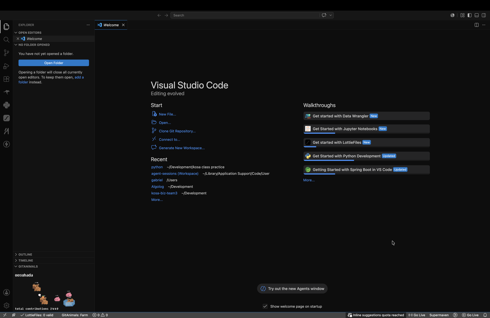
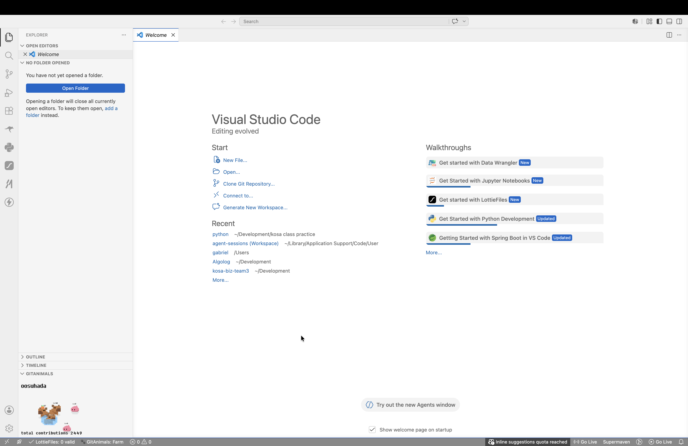

# GitAnimals for VS Code

GitAnimals for VS Code is a small independent extension that keeps your GitAnimals farm and contribution line close to your editor.

The default GitHub username is `oosuhada`.

VS Code does not expose an official API for arbitrary HTML overlays on top of an existing text editor. Like visual companion extensions, this extension uses an Explorer webview view and positions GitAnimals at the bottom-left inside that view without opening a new editor tab.

## Screenshots

### Dark Theme



### Light Theme



## Usage

1. Press `F5` to launch the Extension Development Host.
2. Click `🐾 GitAnimals` in the Status Bar to choose Farm or Line, refresh, hide, show, or open settings.
3. Run `GitAnimals: Open Full View` from the Command Palette for a larger farm view.
4. The Explorer view renders only the selected GitAnimals image without in-view controls.

The Explorer view height is controlled by VS Code, so the extension cannot force a larger initial section height. The image is clamped to the available view height to keep the username and contribution text visible even when the section opens in a small space.

## Settings

```jsonc
{
  "gitanimals.username": "oosuhada",
  "gitanimals.viewMode": "farm",
  "gitanimals.usernameScale": 0.62,
  "gitanimals.showUsername": true,
  "gitanimals.showContributions": true,
  "gitanimals.imageScaleMode": "fill-width",
  "gitanimals.autoRefreshIntervalMinutes": 10
}
```

- `gitanimals.viewMode`: choose `farm` or `line`.
- `gitanimals.usernameScale`: make the visible farm username smaller or larger.
- `gitanimals.showUsername`: hide or show the farm username label.
- `gitanimals.showContributions`: hide or show the farm total contributions label.
- `gitanimals.imageScaleMode`: choose `fill-width`, `fit`, or `fixed`.

## Local Packaging

```bash
npm install -g @vscode/vsce
vsce package
code --install-extension gitanimals-vscode-0.0.1.vsix
```
