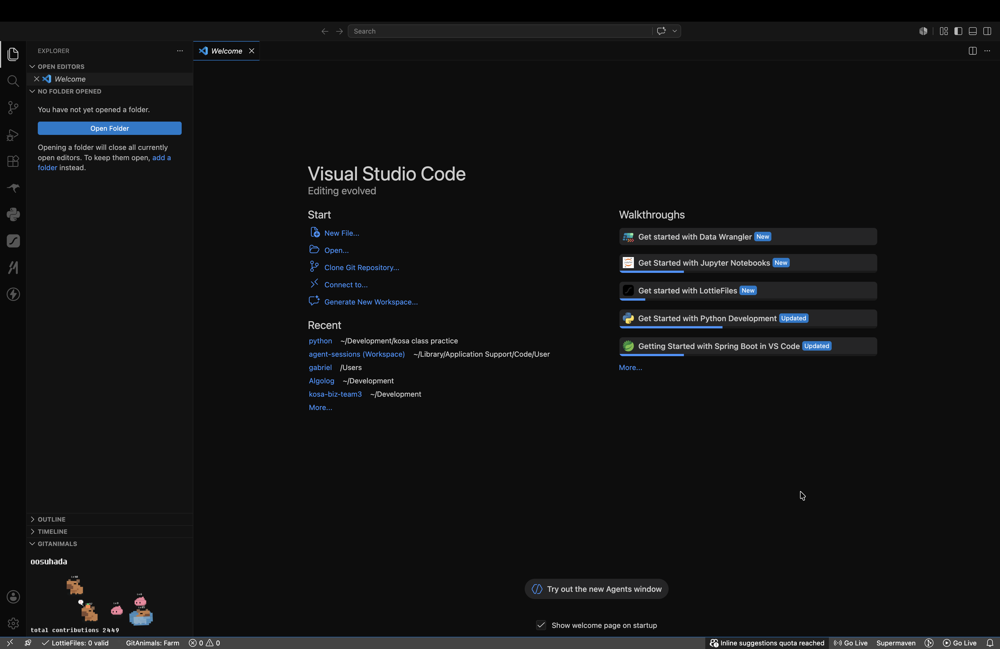
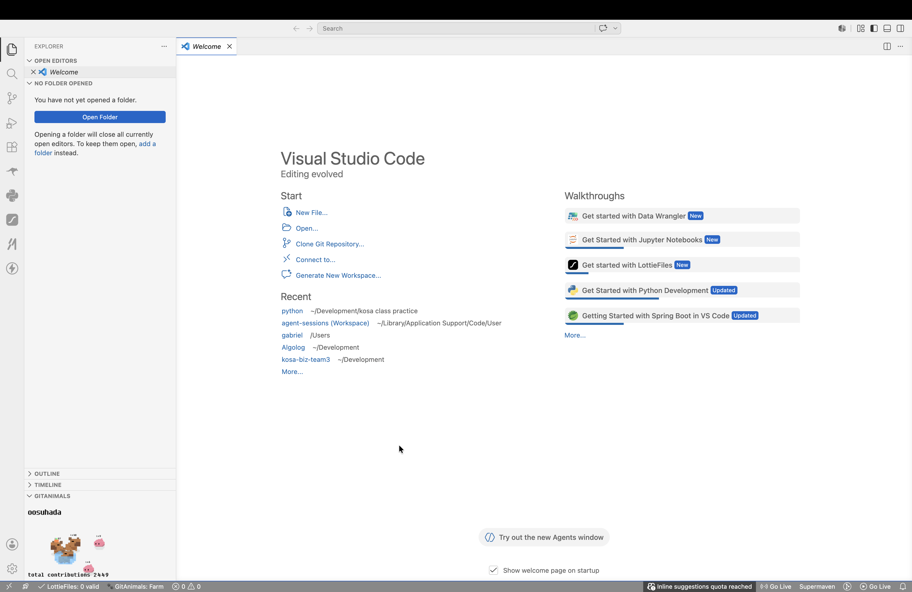

# GitAnimals for VS Code

GitAnimals for VS Code is a small independent extension that keeps your GitAnimals farm and contribution line close to your editor.

## Why I Built It / 만든 이유

Inspired by a teammate using a Pokémon extension in VS Code, I wanted that same experience for the GitAnimals which was already connected to my GitHub commits. Bringing my pet farm and live contribution count directly into the editor makes every commit feel rewarding.

옆자리 동료가 포켓몬 확장 프로그램을 띄워두고 코딩하는 걸 보고 영감을 받았습니다. 이미 git과 연결되어 있던 GitAnimals의 실시간 contribution를 개발 환경에 항상 띄워두면 작은 커밋 하나하나가 훨씬 뿌듯할 것 같았습니다. 그래서 VS Code 안으로 가져왔습니다

## Overview / 개요

GitAnimals for VS Code는 GitHub 기여 기록을 캐릭터/농장 형태로 보여주는 GitAnimals 이미지를 **VS Code Explorer 안에서 바로 확인할 수 있게 만든 작은 확장 프로그램**입니다.

- 새 editor tab을 열지 않고 Explorer webview에서 Farm/Line 이미지를 표시합니다.
- Status Bar와 Command Palette에서 보기 방식, 새로고침, 숨김/표시, 설정을 제어합니다.
- username, image scale, contribution label, 자동 새로고침 주기를 설정할 수 있습니다.
- Dark/Light 실제 동작 화면을 아래 스크린샷으로 확인할 수 있습니다.

VS Code가 기존 editor 위 임의 HTML overlay를 공식 지원하지 않기 때문에, 구현은 지원되는 Explorer webview API 범위 안에서 동작하도록 설계했습니다.

## Screenshots

### Dark Theme



### Light Theme



## Usage

1. Press `F5` to launch the Extension Development Host.
2. Click `🐾 GitAnimals` in the Status Bar to choose Farm or Line, refresh, hide, show, or open settings.
3. Run `GitAnimals: Open Full View` from the Command Palette for a larger farm view.
4. The Explorer view renders only the selected GitAnimals image without in-view controls.

The Explorer view height is controlled by VS Code, so the extension cannot force a larger initial section height. The image is clamped to the available view height to keep the username and contribution text visible even when the section opens in a small space.

## Settings

```jsonc
{
  "gitanimals.username": "oosuhada",
  "gitanimals.viewMode": "farm",
  "gitanimals.usernameScale": 0.62,
  "gitanimals.showUsername": true,
  "gitanimals.showContributions": true,
  "gitanimals.imageScaleMode": "fill-width",
  "gitanimals.autoRefreshIntervalMinutes": 10
}
```

- `gitanimals.viewMode`: choose `farm` or `line`.
- `gitanimals.usernameScale`: make the visible farm username smaller or larger.
- `gitanimals.showUsername`: hide or show the farm username label.
- `gitanimals.showContributions`: hide or show the farm total contributions label.
- `gitanimals.imageScaleMode`: choose `fill-width`, `fit`, or `fixed`.

## Local Packaging

```bash
npm install -g @vscode/vsce
vsce package
code --install-extension gitanimals-vscode-0.0.1.vsix
```

## Topics

[`developer-tools`](https://github.com/topics/developer-tools) · [`gitanimals`](https://github.com/topics/gitanimals) · [`github`](https://github.com/topics/github) · [`javascript`](https://github.com/topics/javascript) · [`vscode-extension`](https://github.com/topics/vscode-extension) · [`webview`](https://github.com/topics/webview) · [`visual-studio-code`](https://github.com/topics/visual-studio-code) · [`extension`](https://github.com/topics/extension) · [`github-api`](https://github.com/topics/github-api) · [`productivity`](https://github.com/topics/productivity) · [`gamification`](https://github.com/topics/gamification) · [`open-source`](https://github.com/topics/open-source) · [`api-integration`](https://github.com/topics/api-integration) · [`coding`](https://github.com/topics/coding)
